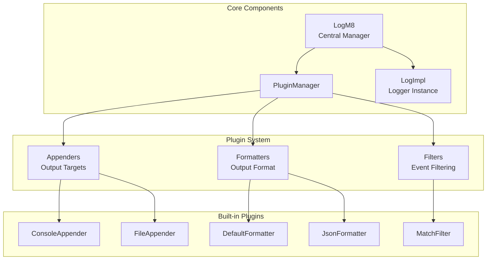
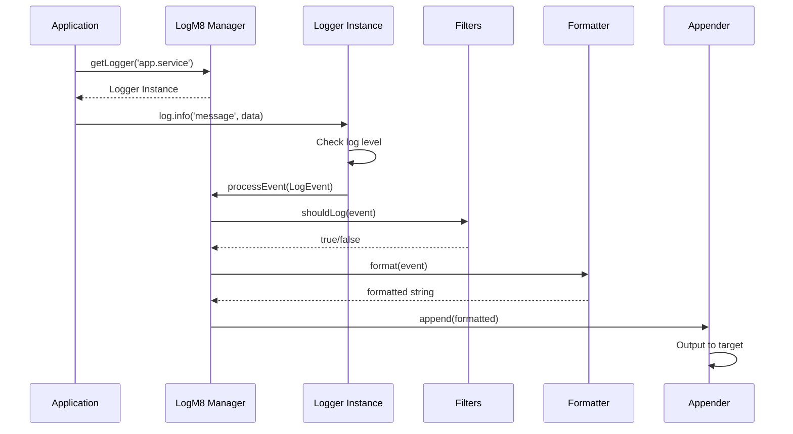
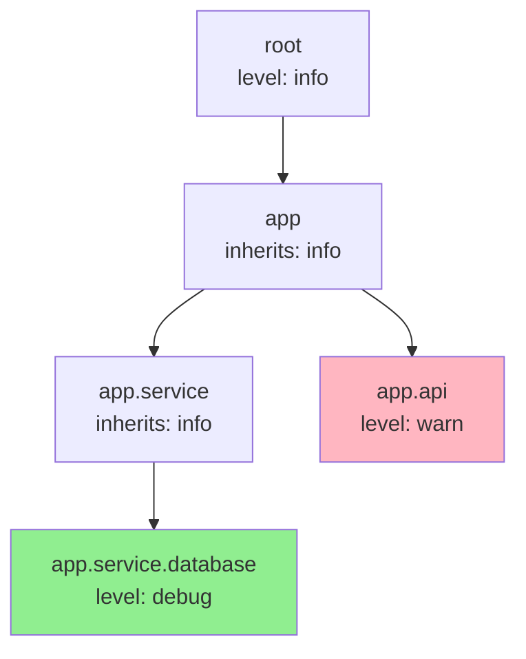
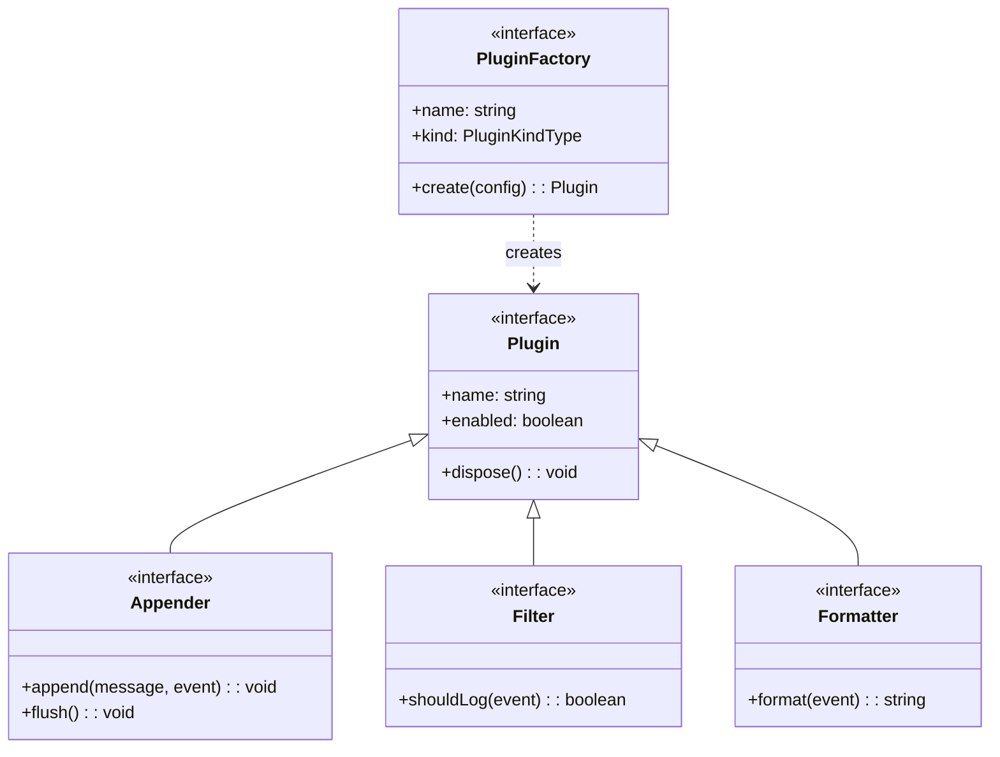
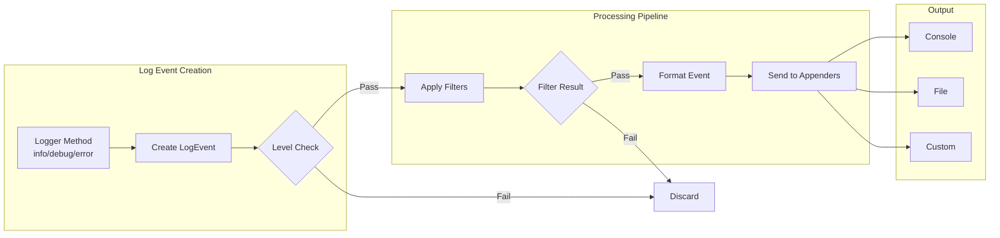
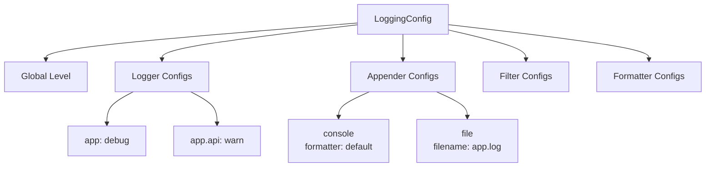
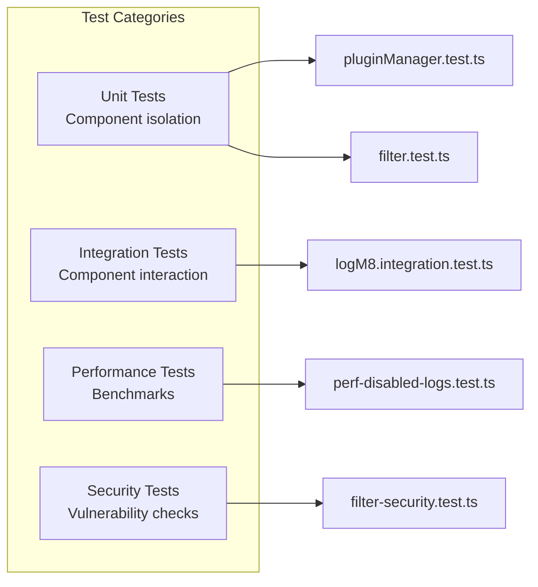

# log-m8 Architecture

## Overview

log-m8 is a flexible, plugin-based logging system designed for TypeScript and JavaScript applications. The architecture emphasizes extensibility, performance, and hierarchical logger organization.

## Core Architecture

## Component Flow

## Hierarchical Logger System

## Plugin Architecture

### Plugin Factory Pattern

## Key Design Patterns

### 1. Singleton Manager
- `LogM8` acts as the central singleton manager
- Manages all logger instances and plugin lifecycle
- Provides global configuration and control

### 2. Factory Pattern
- Plugin factories register with the manager
- Factories create plugin instances on demand
- Enables runtime plugin discovery and creation

### 3. Hierarchical Namespace
- Loggers organized in dot-notation hierarchy (e.g., `app.service.database`)
- Child loggers inherit parent configuration
- Allows fine-grained control at any level

### 4. Event Pipeline
- Log events flow through filters → formatters → appenders
- Each stage can modify or reject events
- Enables complex processing chains

## Data Flow

## Configuration System

## Performance Considerations

### 1. Level Checking
- Log levels are pre-computed as numeric values
- Level checks use fast integer comparison
- Disabled log statements have minimal overhead

### 2. Event Buffering
- Pre-initialization events buffered (max 100)
- Automatic flush on first post-init log
- Prevents event loss during startup

### 3. Lazy Evaluation
- Message formatting deferred until needed
- Filters applied before expensive operations
- Appenders can batch writes

## Extension Points

### Custom Appenders
- Implement `Appender` interface
- Register factory with `PluginManager`
- Examples: Remote logging, database, metrics

### Custom Filters
- Implement `Filter` interface
- Chain multiple filters for complex logic
- Examples: Sampling, rate limiting, content filtering

### Custom Formatters
- Implement `Formatter` interface
- Transform `LogEvent` to any string format
- Examples: CSV, XML, custom JSON schemas

## Security Features

### 1. Input Validation
- All configuration validated on initialization
- Plugin names sanitized
- File paths checked for traversal attacks

### 2. Resource Management
- Automatic cleanup via `dispose()` methods
- File handles properly closed
- Memory buffers limited in size

### 3. Error Isolation
- Plugin errors don't crash the system
- Fallback to console on appender failure
- Graceful degradation of functionality

## Browser vs Node.js

### Build-time Separation
- Node.js-specific code wrapped in markers
- Separate builds for browser and Node.js
- File appender excluded from browser build

### Runtime Detection
- Environment automatically detected
- Appropriate defaults selected
- Console appender works everywhere

## Testing Architecture

## Future Extensibility

The architecture supports future enhancements:
- Async appenders for remote logging
- Plugin marketplace/registry
- Dynamic plugin loading
- Configuration hot-reload
- Structured logging with OpenTelemetry
- Performance profiling hooks